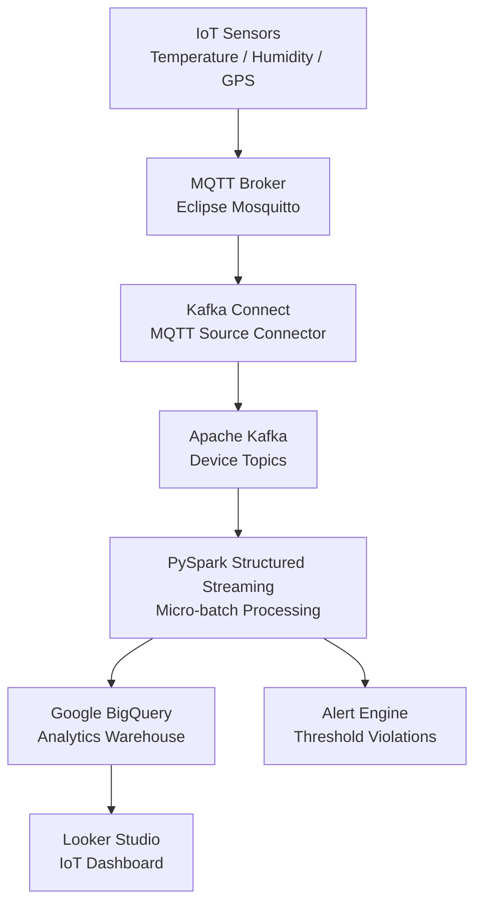

# IoT Streaming Pipeline — Kafka + PySpark + BigQuery


End-to-end IoT data streaming pipeline that collects sensor telemetry from thousands of devices, processes streams in real-time with PySpark Structured Streaming, and loads analytics-ready data into Google BigQuery for BI reporting.

## Architecture



## Features

- MQTT-to-Kafka bridge for IoT device telemetry ingestion
- PySpark Structured Streaming with watermarking and late data handling
- BigQuery partitioned tables for cost-effective analytics
- Real-time anomaly detection and alerting
- Schema evolution support via Confluent Schema Registry
- End-to-end exactly-once delivery guarantee

## Tech Stack

| Layer | Technology |
|-------|-----------|
| Device Protocol | MQTT (Eclipse Mosquitto) |
| Message Bus | Apache Kafka + Kafka Connect |
| Processing | PySpark Structured Streaming |
| Data Warehouse | Google BigQuery |
| Visualization | Looker Studio |
| Orchestration | Docker Compose |

## Prerequisites

- Docker & Docker Compose
- Python 3.10+
- Google Cloud account with BigQuery enabled
- GCP Service Account JSON key

## Quick Start

```bash
git clone https://github.com/zulham-tech/iot-streaming-kafka-pyspark-bigquery.git
cd iot-streaming-kafka-pyspark-bigquery
cp .env.example .env  # add your GCP credentials
docker compose up -d
python producers/iot_simulator.py  # simulate IoT devices
```

## Project Structure

```
.
├── producers/           # IoT device simulators
├── kafka_connect/       # MQTT Source Connector configs
├── spark_jobs/          # PySpark streaming jobs
├── bigquery/            # DDL scripts & table schemas
├── alerts/              # Threshold-based alert engine
├── docker-compose.yml
└── requirements.txt
```

## Author

**Ahmad Zulham Hamdan** — [LinkedIn](https://linkedin.com/in/ahmad-zulham-665170279) | [GitHub](https://github.com/zulham-tech)
